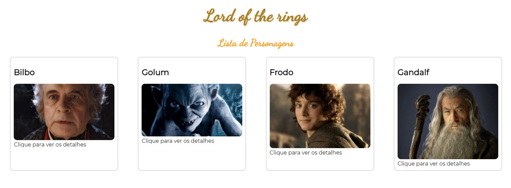

# Lista de Personagens 

Esse projeto foi feito através da biblioteca ReactJs, junto com a utilização de API.

## Como usar

Abra o terminal dentro do diretório e digite o seguinte comando:

### `npm start`

O app será inicializado e você poderá abrir com a seguinte url:
[http://localhost:3000](http://localhost:3000)

